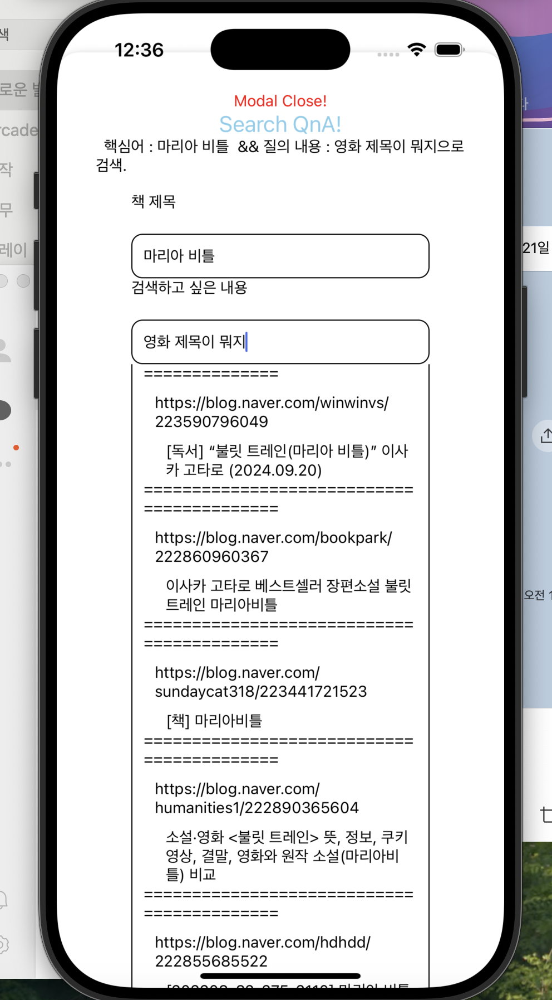
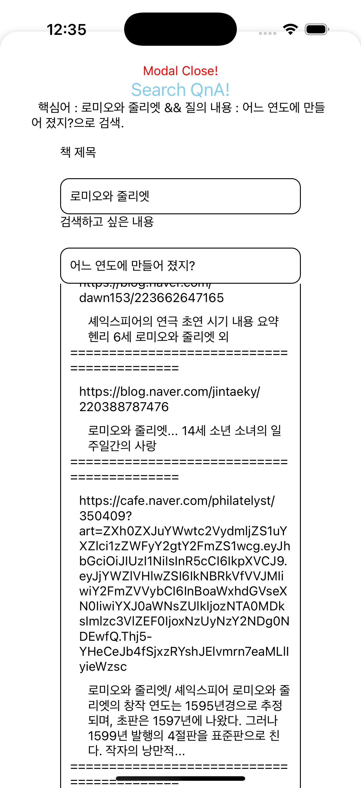

# bookommendBE

접근제어자와 상속구조로 SERVICE DATA DRIVEN DEVELOPMENT 완료 

QNA / TAG 컨트롤러 (서비스) 만듬 형태소 분절-> 명사 추출 -> 크롤링 -> 유사도 측정-> 결과값 리턴 
-- 명확한 한계 =>
1.메인에서만 긁어오기때문에 ... 축약 풀수있는 방법이 없음 방법이 있는데 돔조작 관련 태크 지우기 아니면 쳇 지피티는 스크립트 조작하라는데 내 역량으론 ㅠㅠ 
2.구글링 막혀있음

1-> 그래서 링크를 첨부했다 

1. 아키텍처
pagkage 
  - service  (defualt)
  - controller (public)
  - repository (defualt)
  - serviceSuper (abstract public)
  
  구조로 하였고, serviceSuper에서는 다른 서비스에서 참조할 수 있겠끔(디비조회 가능하게끔) 로직 없이 repository 데이터 리턴함 
  
이유 - repository public 으로 하는게 객체지향에서 맞나 생각들어서 (금고를 모두에게 공개 열어두진 않으니까) (하지만 이건 인텔리제이에서도 노란줄 침)
  
단테 회귀 테스트 다시 해봐야함 
  
2. 보완할 점

- #(완료)인증번호 보내는거 싱글톤으로 해서.. 같은 번호 계속 보내는데 .. 이거 수정
- 비밀번호 변경후 메인 화면 넘어가게 설정... ( 화면 )
- 역할과 구현을 분리!!!!
- 객체 생성할 때 생성자 위주로 변경해야함 (자동주입은 생성자로 다 되어있음)
- ReponseEntity 위주로 컨트롤러 바꿔야할게 몇개 있음
- 보안은 암호화 밖에 적용안됐는데 - spring security 공부하고 변경하겠음
- 통계 데이터 이상함 
- 타임라인 오늘 날짜 이전이면 수정만 가능하도록 변경 해야함
- 기록할때 현재 페이지와 읽은 페이지가 같아도 저장되게 해놨는데 그거 수정해야함 

3. 미개발 
- 로그아웃
- 삭제 로직 등(탈퇴 포함)

4. 책 추천 
- 한정된 화면 스크린 사이즈 때문에 카테고리 기반 추천만 했는데, 이 로직을 좀 더 세분화하거나 
화면 사이즈를 극복하고 다양하게 추천해줄수 있어야함

5. 앞으로는 ...

- firebase 연동 
- 실서비스 돌릴거면 aws 공부 및 적용 

굿? 아구국??
